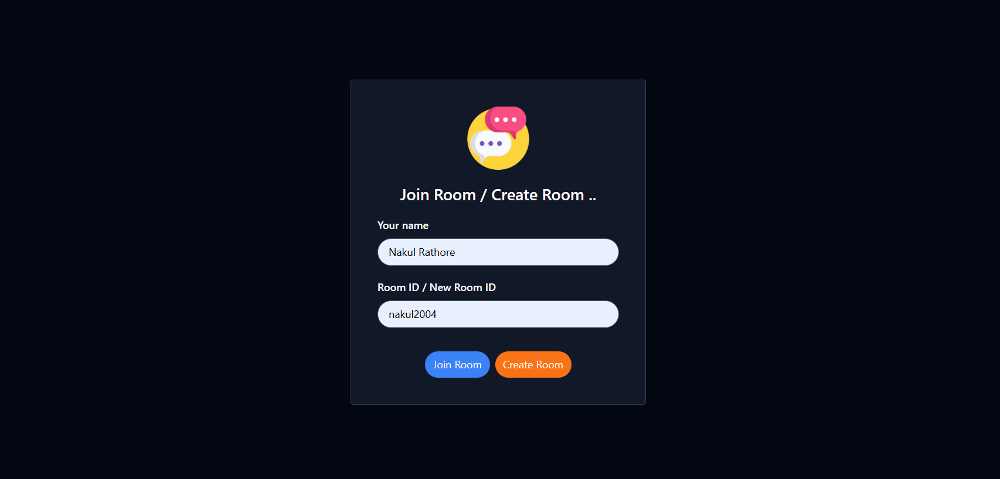
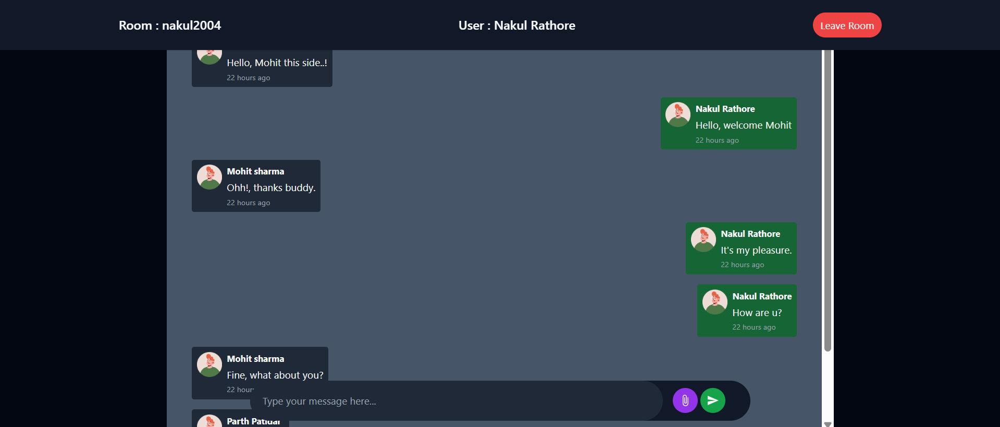

# 💬 TalkSync – Real-Time Chat App

TalkSync is a full-stack real-time chat application built using **React** (Vite) for the frontend and **Spring Boot** with WebSocket (STOMP over SockJS) for the backend. It allows users to join chat rooms, send and receive messages in real-time, and enjoy a seamless chat experience.

---

## 🚀 Features

- 🔐 Join or create unique chat rooms
- 👤 Set your username to enter a room
- 📡 Real-time bi-directional communication via WebSockets
- 🔔 Toast notifications for status updates
- 🌙 Dark mode UI styled with **Tailwind CSS**
- 🔄 Auto-scroll to the latest message
- 🕒 Human-readable timestamps (e.g., "just now", "2 mins ago")
- 💬 Typing and message input with emoji support

---

## 📸 Screenshots

> Add your screenshots inside `/screenshots` folder and link here:

### 🏠 Join Room Page

### 💬 Chat Room in Action

---

## 🛠️ Tech Stack

### 🖥️ Frontend (React + Vite)
- React.js
- Vite
- Tailwind CSS
- React Router
- SockJS Client
- STOMP.js
- React Hot Toast
- Emoji Picker
- React Icons
- Axios

### 🧰 Backend (Spring Boot)
- Spring WebSocket
- STOMP Protocol
- SockJS Fallback
- REST Controllers for historical message fetching

---
